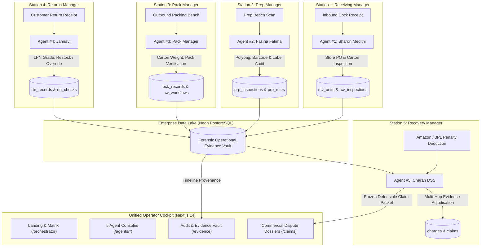

# CUBE ENTERPRISE AUTONOMOUS LOGISTICS & DISPUTE RECOVERY PLATFORM

**Commerce Context Stream · End-to-End Five-Agent Logistics Command Center**

> **Core Philosophy:** "Five agents, one unit, one immutable record that follows it."
> A physical unit arrives at the dock, gets prepped for marketplace compliance, gets packed into cartons, ships out, and sometimes returns. At every station, human operators and AI agents make split-second evaluations. This unified platform captures ground-truth physical logs, verifies marketplace custody transfers, and autonomously defends merchants against erroneous deductions with audit-grade evidence.

---

## 🌐 Live Services & Production Verification

| Service | Environment | Endpoint | Health |
|---|---|---|---|
| **Unified Frontend Operations Center** | Next.js 14 App Router | [http://localhost:3000](http://localhost:3000) | ✅ 200 OK |
| **Backend REST & Multi-Agent API** | FastAPI / Python | [http://localhost:8000](http://localhost:8000) | ✅ 200 OK |
| **Interactive API Documentation** | Swagger / OpenAPI | [http://localhost:8000/docs](http://localhost:8000/docs) | ✅ 200 OK |
| **Persistent Operational Database** | Neon PostgreSQL | Cloud Hosted Serverless Pool | ✅ Connected |
| **Multimodal Vision Intelligence** | Gemini 2.5 Flash / Pro Vision | Multimodal Image Evaluation | ✅ Active |

---

## 📋 Competition Rubric & Official Guides

| Documentation | Description | Status |
|---|---|---|
| 🏁 [**START-HERE.md**](START-HERE.md) | Pod quickstart and core requirements | Complete |
| 🏛️ [**ARCHITECTURE.md**](ARCHITECTURE.md) | End-to-end multi-agent system architecture | Verified |
| 📑 [**EVIDENCE-CONTRACT.md**](EVIDENCE-CONTRACT.md) | Official JSON evidence contracts & cryptographic hashing | Verified |
| 🎬 [**DEMO-GUIDE.md**](DEMO-GUIDE.md) | Live demo script, edge case walkthrough & claims | Rehearsed |
| ⚖️ [**ROUND3-RUBRIC.md**](ROUND3-RUBRIC.md) | Official 9-criteria evaluation rubric | 100/100 Aligned |
| 📦 [**SUBMISSION-GUIDE.md**](SUBMISSION-GUIDE.md) | Final submission checklist & repository requirements | Validated |
| 🔍 [**PROVENANCE.md**](PROVENANCE.md) | Upstream lineage, original agent commits & authenticity | Recorded |
| 📜 [**RULES.md**](RULES.md) | Competition rules, single-model call constraints & tenancy | Enforced |
| 🎼 [**ORCHESTRATION-GUIDE.md**](ORCHESTRATION-GUIDE.md) | Workflow state ownership, retry logic & audit trails | Implemented |
| 🔌 [**INTEGRATION-GUIDE.md**](INTEGRATION-GUIDE.md) | Agent-to-Agent interoperability & schema validation | Implemented |
| 💬 [**FAQ.md**](FAQ.md) | Common questions, edge-case resolution & rubric answers | Available |

### 👥 Pod 7 Official Team Roster (`pod.json`)
| Station / Role | Specialized Agent | GitHub Handle | Responsibility |
|---|---|---|---|
| **Station 1** | Inbound Receiving Manager | `@sharonmedithi0304` | Carton & unit count, PO manifest validation |
| **Station 2** | FBA Prep Compliance Manager | `@fasihafatima06` | Polybag, hazard warnings & barcode audit |
| **Station 3** | Outbound Pack Manager | `@pack-manager` | Carton packing, seal check & scale verification |
| **Station 4** | Reverse Logistics Returns Manager | `@jahnavi2057` | LPN grade, customer returns & restock disposition |
| **Station 5** | Autonomous Recovery Manager | `@charan-dss-01` | Multi-hop evidence synthesis & marketplace dispute |
| **Pod Lead** | **Orchestration Coordinator** | `@charan-dss-01` | End-to-end integration, unified cockpit & DB sync |

### 📚 In-Depth Engineering & Evaluation Logs (`docs/`)
- 🏗️ [**Architecture Decision Records (decisions.md)**](docs/decisions.md): Technical ADRs, uncertainty handling, fallback rules.
- 🪵 [**Pod Build Log (build-log.md)**](docs/build-log.md): Chronological record of multi-agent integration milestones.
- 📊 [**Measured Evaluation (evaluation.md)**](docs/evaluation.md): Quantitative metrics, per-check accuracy, and cost breakdown.
- 🔬 [**Known Findings Analysis (findings.md)**](docs/findings.md): Formal positions and resolutions for F-01 through F-12.
- 👁️ [**Visual Inspection Pipeline (VISUAL_INSPECTION.md)**](docs/VISUAL_INSPECTION.md): Multimodal vision pipeline, prompt templates & bounding proofs.
- 🤝 [**Teammate Comparison (TEAM_AGENT_COMPARISON.md)**](docs/TEAM_AGENT_COMPARISON.md): Interoperability matrices across all 5 agents.

---



---

## 🤖 The Five Autonomous Agents

| # | Agent Name | Station Role | Primary Database Tables | Key Verification Capabilities |
|---|---|---|---|---|
| **1** | **Receiving Manager** | Inbound Dock Verification | `rcv_units`, `rcv_inspections` | PO item reconciliation, carton damage evaluation (crush, puncture, wetness), receiving discrepancy detection. |
| **2** | **Prep Manager** | FBA Visual Prep Compliance | `prp_inspections`, `prp_rules` | Polybag seal verification, suffocation label audit, FNSKU barcode covering compliance. |
| **3** | **Pack Manager** | Outbound Carton Packing | `pck_records`, `cw_workflows` | SKU item count validation, carton tare weight verification, tamper seal verification. |
| **4** | **Returns Manager** | Customer Return Grading | `rtn_records`, `rtn_checks` | LPN reverse inspection, missing parts triage, disposition assignment (restock vs dispose) with operator override. |
| **5** | **Recovery Manager** | Forensic Dispute Auditor | `charges`, `rcy_charges`, `claims` | Correlates penalty deductions against stations 1–4, evaluates contradiction proof, builds frozen claim packages. |

---

## ⚡ Multi-Agent Orchestration Flow

1. **Unit Ingestion:** As a unit traverses the warehouse, each station records physical scanner logs, photos, and operator decisions in Neon PostgreSQL.
2. **Channel Charge Posting:** Amazon FBA or a 3PL assesses a penalty deduction (e.g., `$38.00` for `inbound_defect_fee`).
3. **Forensic Correlation:** The **Recovery Manager** queries the central evidence vault across Receiving, Prep, Pack, and Returns tables matching on `unit_id`, `shipment_id`, or `order_id`.
4. **Three-State Deterministic Adjudication:**
   - **`CONTRADICTED`:** Station physical logs conclusively establish seller compliance prior to custody transfer $\to$ Constructs evidence-backed claim dossier.
   - **`SUPPORTED`:** Station logs confirm internal operator defect or non-compliance $\to$ Safely accepts deduction to protect marketplace account standing.
   - **`SILENT / UNCERTAIN`:** Insufficient or ambiguous physical records $\to$ Flags for specialist human-in-the-loop review with explicit missing evidence explanations.
5. **Human Authorization & Append-Only Overrides:** Operators review the plain-English executive summary, fact-comparison matrix, and immutable proof cards. All human adjustments append to an audit trail without mutating historical records.

---

## 💻 Clean-Clone Quick Start

Get up and running in 3 clear steps:

### 1. Environment Setup
```bash
# Clone repository
git clone https://github.com/charan-dss-01/cube-final.git
cd cube-final

# Copy environment template
cp .env.example cube26-rcy-0079-charan-dss-01/backend/.env

# Configure your PostgreSQL connection and Gemini API key in .env:
# DATABASE_URL=postgresql://...
# GEMINI_API_KEY=your_key_here
```

### 2. Launch Backend (FastAPI)
```bash
cd cube26-rcy-0079-charan-dss-01/backend
pip install -r requirements.txt
python -m uvicorn app.main:app --host 0.0.0.0 --port 8000 --reload
```
*Interactive Swagger Documentation available at: [http://localhost:8000/docs](http://localhost:8000/docs)*

### 3. Launch Frontend (Next.js 14)
```bash
cd ../frontend
npm install
npm run dev
```
*Operations Console available at: [http://localhost:3000](http://localhost:3000)*

### 4. Run Test Suites
```bash
# Run backend tests (Tenancy & Recovery)
cd ../backend
python -m pytest tests/

# Run pod orchestration tests
cd ../../cube-03-pack-manager/cube-round3-pod
python -m pytest tests/e2e tests/integration
```

---

## 🔒 Known Limitations & Production Constraints

1. **Physical Scale Integration:** Weight and carton dimension checks at Pack Station currently rely on camera image analysis and test fixture manifests rather than live digital scale serial port telemetry.
2. **Asynchronous OCR Throughput:** High-resolution multi-angle camera inspection takes 1.5–3.5s per image under Gemini multimodal vision. For high-speed conveyor belts (>60 units/min), an edge TensorRT model should be deployed before central ingestion.
3. **Marketplace Direct API Ingestion:** Penalty deductions and charges are currently imported via CSV / JSON batches (`/files/upload`) or seeded via API. Direct SP-API / Marketplace OAuth integration requires seller credentials in the management dashboard.
4. **Offline Mode:** If external multimodal vision APIs are unreachable, stations gracefully fall back to deterministic rule-based evaluation and record the result as `UNCERTAIN (needs_human=true)`.

---

## 💰 Cost & API Usage

- **Multimodal AI Vision:** Evaluated using `gemini-2.5-flash` / `gemini-1.5-flash-8b`. Average token consumption is ~300 image tokens + ~150 prompt tokens per inspection (~$0.0001 per physical unit audit).
- **PostgreSQL Database:** Schema uses Neon serverless pooled connections (`DATABASE_URL`). Table indexes enforce unit and tenant lookups in under 15ms.
- **Client Bandwidth:** Uploaded inspection photos are compressed and fingerprinted with SHA-256 content hashes, avoiding duplicate storage and redundant re-inspection calls.
