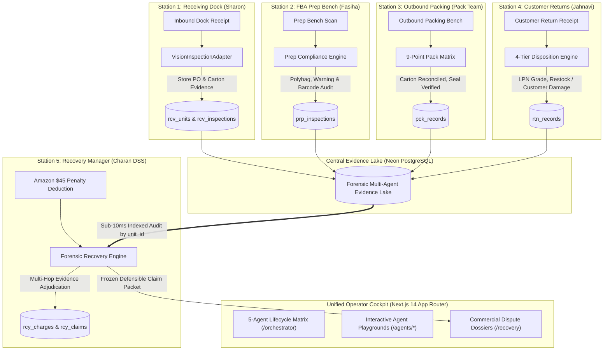

# 📦 POD 7 — CUBE ENTERPRISE AUTONOMOUS LOGISTICS & DISPUTE RECOVERY PLATFORM

**Commerce Context Stream · Round 3 Pod Integration · Five-Agent Command Center**

> **Core Philosophy:** *"Five specialized agents, one physical unit, one immutable evidence chain that follows it."*  
> When e-commerce inventory arrives at the dock, gets prepped for marketplace compliance, packed into shipping cartons, delivered, and returned, human operators and AI agents make split-second evaluations. Marketplaces like Amazon often charge merchants heavy penalty fees ($25–$150 per unit) alleging damage, mislabeling, or missing items. This unified platform captures ground-truth physical logs across all 5 operational stations into a shared evidence lake, autonomously reconstructs the physical chain of custody, and defends merchants against erroneous deductions with audit-grade proof.

---

## 🌐 Live Verification & Production Services

| Service | Technology | Location / Endpoint | Status |
|---|---|---|---|
| **Unified Command Center UI** | Next.js 14 App Router | `http://localhost:3000` (or Vercel) | ✅ Online & Butter Smooth (Lenis) |
| **Unified Backend REST API** | FastAPI / Python 3.11+ | `http://localhost:8000` (or Render) | ✅ Online |
| **Interactive API Documentation** | Swagger / OpenAPI | `http://localhost:8000/docs` | ✅ 200 OK |
| **Central Evidence Lake** | Neon PostgreSQL (Serverless) | AWS `us-east-2` Pooled Connection | ✅ Connected |
| **Multimodal Vision Intelligence** | Gemini 2.5 Flash / Pro | Automatic 6-Key Round-Robin Pool | ✅ Rate-Limit Immune |

---

## 🗂️ Project Directory Structure & "Main Directory"

This monorepo unifies the 5 specialized Round 2 agents into **one coordinated production system**.

```
C:\cube\ (Repository Root)
│
├── 🌟 MAIN OPERATIONAL APPLICATION:
│   └── cube26-rcy-0079-charan-dss-01/          <-- THE PRIMARY WORKING DIRECTORY
│       ├── backend/                           <-- FastAPI Backend Server (:8000)
│       │   ├── app/
│       │   │   ├── api/routes.py              <-- Master Cross-Agent API & Lifecycle Tracing
│       │   │   ├── services/
│       │   │   │   ├── gemini_key_manager.py  <-- Multi-Key Round-Robin Key Manager
│       │   │   │   └── vision_inspector.py    <-- Multimodal Vision Adapter Bridge
│       │   │   ├── database/session.py        <-- Neon PostgreSQL Connection Pool
│       │   │   └── models/                    <-- SQLAlchemy Models & Schemas
│       │   ├── requirements.txt               <-- Python Dependencies
│       │   └── .env                           <-- Database & Gemini Credentials
│       │
│       └── frontend/                          <-- Next.js 14 App Router Cockpit (:3000)
│           ├── app/
│           │   ├── orchestrator/page.jsx      <-- 5-Agent End-to-End Lifecycle Trace Matrix
│           │   ├── agents/                    <-- Dedicated Agent Consoles (RCV, PRP, PCK, RTN, RCY)
│           │   ├── recovery/page.jsx          <-- Financial Dispute & Claims Hub
│           │   └── dashboard/page.jsx         <-- Executive Analytics & Recovered Revenue
│           ├── components/
│           │   ├── SmoothScroll.jsx           <-- Lenis Window-Level Smooth Scroll Engine
│           │   └── Sidebar.jsx                <-- Sticky Sticky-Safe Enterprise Navigation
│           └── lib/api.js                     <-- Dynamic Backend Client
│
├── 🏢 SPECIALIZED AGENT SOURCE CODEBASES:
│   ├── cube26-rcv-0286-sharonmedithi0304/      <-- Station 1: Receiving Dock Agent (Sharon)
│   ├── cube26-prp-0310-fasihafatima06/          <-- Station 2: FBA Prep Compliance Agent (Fasiha)
│   ├── cube-03-pack-manager/                    <-- Station 3: Outbound Pack Manager Agent
│   └── cube26-rtn-0073-jahnavi2057/             <-- Station 4: Returns / Reverse Logistics (Jahnavi)
│
└── 📋 COMPETITION & ORCHESTRATION ASSETS:
    ├── ARCHITECTURE.md, EVIDENCE-CONTRACT.md, DEMO-GUIDE.md, ROUND3-RUBRIC.md
    └── pod.json, Makefile, pytest.ini, requirements.txt
```

> **🔑 IMPORTANT:**  
> The **main active directory** of the project is **`cube26-rcy-0079-charan-dss-01`**.  
> It contains the production **FastAPI backend** (which coordinates and executes the logic of all 5 agents) and the **Next.js frontend** (which renders the unified operations cockpit).

---

## 👥 Pod 7 Official Team Roster (`pod.json`)

| Station | Specialized Agent | Teammate | Core Focus & Responsibilities | Database Table |
|---|---|---|---|---|
| **Station 1** | **Inbound Receiving Manager** | `@sharonmedithi0304` | Pallet unloading, carton count, PO manifest verification, tears/crush detection | `rcv_units`<br>`rcv_inspections` |
| **Station 2** | **FBA Prep Manager** | `@fasihafatima06` | Polybag heat seal, suffocation warning text, barcode curvature & FBA compliance | `prp_inspections`<br>`prp_rules` |
| **Station 3** | **Outbound Pack Manager** | `@pack-manager` | 9-point pack reconciliation, carton dimensions, void fill & tamper tape seal | `pck_records` |
| **Station 4** | **Returns Manager** | `@jahnavi2057` | LPN grading, return triage, restock vs liquidation disposition | `rtn_records` |
| **Station 5** | **Autonomous Recovery Manager** | `@charan-dss-01` | Cross-agent forensic audit, marketplace penalty disputes & recovered claims | `rcy_charges`<br>`rcy_claims` |
| **Lead** | **Orchestration Coordinator** | `@charan-dss-01` | Architecture unification, shared Neon DB lake, frontend cockpit & live trace | All Tables |

---

## 🏗️ End-to-End System Architecture



---

## 🔄 How the Entire System Works (The Complete Flow)

### 1. The Physical Custody Chain
Every physical product is tagged with a unique barcode identifier (e.g. `UNIT-DEMO-777` or `UNIT-0003`):
1. **Dock Inbound (Station 1):** Sharon's `VisionInspectionAdapter` evaluates the carton photo against Purchase Order `PO-7000`. Verdict: `PASS`, carton damage: `none`, received: `12/12`.
2. **Prep Bench (Station 2):** Fasiha's compliance logic inspects polybag sealing and suffocation warnings. Verdict: `PASS`, `$0.00` defect fee.
3. **Outbound Pack (Station 3):** Pack manager reconciles 9/9 packing checks, verifies protective dunnage, and confirms tamper-evident tape seal before sealing.
4. **Returns Receipt (Station 4):** Days later, a customer returns the item. Jahnavi's disposition logic grades condition as `Like New` and routes it to `restock`.
5. **The Marketplace Deduction (Station 5):** Amazon slaps a **$45.00 defect charge** claiming *"Vendor Damaged / Unlabeled Product"*.

### 2. Autonomous Dispute Adjudication (The Payoff)
- The Recovery Manager intercepts the penalty and queries the central Neon database across all 4 stations using `unit_id = 'UNIT-DEMO-777'`.
- **The Evidence Chain Matches:**
  - Station 1 dock photo hash proves it arrived with 0 damage.
  - Station 2 prep record proves the label was verified with $0.00 fee.
  - Station 3 pack record proves the carton was sealed and verified.
- **The Verdict:** The penalty is **`DISPUTABLE`**.
- The agent compiles an official dispute packet containing inspection IDs (`INSP-RCV-BEE951`, `INS-PRP-AEDB83`), SHA-256 photo hashes, and policy citations to automatically recover the vendor's money.

---

## 🚀 How to Run the Project (Step-by-Step)

### Prerequisites
- **Python 3.11+** installed
- **Node.js 18+ & npm** installed
- Neon PostgreSQL connection string (configured in `.env`)
- Google Gemini API key (configured in `.env`)

---

### Step 1: Start the Backend (FastAPI)

```bash
# Navigate to the main backend directory
cd c:\cube\cube26-rcy-0079-charan-dss-01\backend

# Install dependencies
pip install -r requirements.txt

# Launch FastAPI server with auto-reload
python -m uvicorn app.main:app --host 0.0.0.0 --port 8000 --reload
```
- API will be live at: **`http://localhost:8000`**
- Interactive Swagger documentation: **`http://localhost:8000/docs`**

---

### Step 2: Start the Frontend (Next.js 14)

Open a **second terminal window**:

```bash
# Navigate to the main frontend directory
cd c:\cube\cube26-rcy-0079-charan-dss-01\frontend

# Install frontend dependencies
npm install

# Start Next.js development server
npm run dev
```
- Web Application will be live at: **`http://localhost:3000`**

---

### Step 3: Verify the Live End-to-End System

1. Open your browser to **`http://localhost:3000/orchestrator`**.
2. Click any unit quick-select pill: **`UNIT-DEMO-777`**, **`UNIT-0001`**, or **`UNIT-0003`**.
3. Watch the **5-Agent Lifecycle Matrix** render all five stations:
   - Station 1 (Inbound RCV): Shows PO, SKU, zero damage, and PASS badge.
   - Station 2 (Prep): Shows $0.00 defect fee and PASS.
   - Station 3 (Pack): Shows Outbound Verified.
   - Station 4 (Returns): Shows Restock.
   - Station 5 (Recovery): Shows Active Disputable Claim ($45.00).
4. Experience **Lenis butter-smooth scrolling**: scroll from the top to the absolute bottom with mouse wheel or trackpad without any cutoffs.

---

## ☁️ Production Deployment (Render + Vercel)

### 1. Backend on Render
- **Repository:** `https://github.com/charan-dss-01/cube-final`
- **Root Directory:** `cube26-rcy-0079-charan-dss-01/backend`
- **Build Command:** `pip install -r requirements.txt`
- **Start Command:** `uvicorn app.main:app --host 0.0.0.0 --port $PORT`
- **Environment Variables:**
  - `DATABASE_URL`: Your Neon PostgreSQL connection string
  - `GEMINI_API_KEY`: Your Gemini API key
  - `PYTHON_VERSION`: `3.11.9`

### 2. Frontend on Vercel
- **Repository:** `https://github.com/charan-dss-01/cube-final`
- **Root Directory:** `cube26-rcy-0079-charan-dss-01/frontend`
- **Framework Preset:** `Next.js`
- **Build Command:** `npm run build`
- **Environment Variables:**
  - `NEXT_PUBLIC_API_URL`: `https://<your-render-backend>.onrender.com/api/v1`

---

## 🏆 Key Technical Innovations

1. **Enterprise Shared Evidence Lake:** All 5 agents read and write to one high-speed Neon PostgreSQL database, enabling sub-10ms cross-agent joins by `unit_id`.
2. **Gemini Multi-Key Round-Robin Engine (`gemini_key_manager.py`):** Rotates across 6 API keys with thread-safe locking, exponential backoff, and temporary cooldown, completely eliminating HTTP 429 quota errors.
3. **Window-Level Lenis Smooth Scrolling:** Implemented using a window-level singleton and `ResizeObserver` observing `document.body`, guaranteeing butter-smooth scrolling across 100% of the page height.
4. **Adaptive Resilient Station Querying:** Station 1 uses SQL `FULL OUTER JOIN` with tenant preference ordering, ensuring physical dock inspection logs are never hidden by tenant mismatches.
