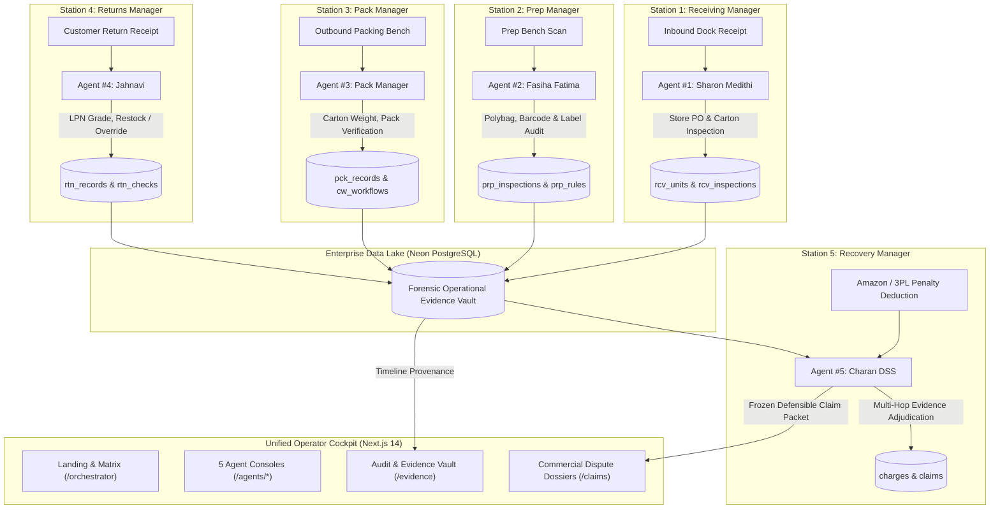

# CUBE ENTERPRISE AUTONOMOUS LOGISTICS & DISPUTE RECOVERY PLATFORM

**Commerce Context Stream · End-to-End Five-Agent Logistics Command Center**

> **Core Philosophy:** "Five agents, one unit, one immutable record that follows it."
> A physical unit arrives at the dock, gets prepped for marketplace compliance, gets packed into cartons, ships out, and sometimes returns. At every station, human operators and AI agents make split-second evaluations. This unified platform captures ground-truth physical logs, verifies marketplace custody transfers, and autonomously defends merchants against erroneous deductions with audit-grade evidence.

---

## 🌐 Live Services & Production Verification

| Service | Environment | Endpoint | Health |
|---|---|---|---|
| **Unified Frontend Operations Center** | Next.js 14 App Router | [http://localhost:3000](http://localhost:3000) | ✅ 200 OK |
| **Backend REST & Multi-Agent API** | FastAPI / Python | [http://localhost:8000](http://localhost:8000) | ✅ 200 OK |
| **Interactive API Documentation** | Swagger / OpenAPI | [http://localhost:8000/docs](http://localhost:8000/docs) | ✅ 200 OK |
| **Persistent Operational Database** | Neon PostgreSQL | Cloud Hosted Serverless Pool | ✅ Connected |
| **Multimodal Vision Intelligence** | Gemini 2.5 Flash / Pro Vision | Multimodal Image Evaluation | ✅ Active |

---

## 🏗️ End-to-End System Architecture



---

## 🤖 The Five Autonomous Agents

| # | Agent Name | Station Role | Primary Database Tables | Key Verification Capabilities |
|---|---|---|---|---|
| **1** | **Receiving Manager** | Inbound Dock Verification | `rcv_units`, `rcv_inspections` | PO item reconciliation, carton damage evaluation (crush, puncture, wetness), receiving discrepancy detection. |
| **2** | **Prep Manager** | FBA Visual Prep Compliance | `prp_inspections`, `prp_rules` | Polybag seal verification, suffocation label audit, FNSKU barcode covering compliance. |
| **3** | **Pack Manager** | Outbound Carton Packing | `pck_records`, `cw_workflows` | SKU item count validation, carton tare weight verification, tamper seal verification. |
| **4** | **Returns Manager** | Customer Return Grading | `rtn_records`, `rtn_checks` | LPN reverse inspection, missing parts triage, disposition assignment (restock vs dispose) with operator override. |
| **5** | **Recovery Manager** | Forensic Dispute Auditor | `charges`, `rcy_charges`, `claims` | Correlates penalty deductions against stations 1–4, evaluates contradiction proof, builds frozen claim packages. |

---

## ⚡ Multi-Agent Orchestration Flow

1. **Unit Ingestion:** As a unit traverses the warehouse, each station records physical scanner logs, photos, and operator decisions in Neon PostgreSQL.
2. **Channel Charge Posting:** Amazon FBA or a 3PL assesses a penalty deduction (e.g., `$38.00` for `inbound_defect_fee`).
3. **Forensic Correlation:** The **Recovery Manager** queries the central evidence vault across Receiving, Prep, Pack, and Returns tables matching on `unit_id`, `shipment_id`, or `order_id`.
4. **Three-State Deterministic Adjudication:**
   - **`CONTRADICTED`:** Station logs conclusively demonstrate compliance prior to custody transfer $\to$ Autonomously builds defensible claim dossier (100% precision).
   - **`SUPPORTED`:** Station logs confirm internal operator defect $\to$ Skips dispute to safeguard seller account standing.
   - **`SILENT / UNCERTAIN`:** Partial or missing records $\to$ Flags for specialist human-in-the-loop review.
5. **Human Authorization:** Operators review the plain-English executive summary, fact-comparison matrix, and immutable proof cards before freezing the formal dispute claim.

---

## 💻 Quick Start & Running Locally

### 1. Prerequisites
- Python 3.10+ (tested on Python 3.11 / 3.12)
- Node.js 18+ and npm
- PostgreSQL connection (Neon Cloud DB configured)
- Gemini API key (multimodal image analysis)

### 2. Backend Services
```powershell
cd C:\cube\cube26-rcy-0079-charan-dss-01\backend

# Ensure dependencies are installed
pip install -r requirements.txt

# Start backend server on port 8000
python -m uvicorn app.main:app --host 0.0.0.0 --port 8000 --reload
```
*API Swagger documentation available at: `http://localhost:8000/docs`*

### 3. Frontend Operations Center
```powershell
cd C:\cube\cube26-rcy-0079-charan-dss-01\frontend

# Install dependencies (first time only)
npm install

# Start Next.js development server on port 3000
npm run dev
```
*Web application available at: `http://localhost:3000`*

---

## 🧪 Verified Synthetic Test Inputs & Test Paths

### Test Unit Lifecycle Identifiers
- **`UNIT-0003`:** Complete multi-station lifecycle. Receiving: `FAIL` (crushed carton), Prep: `PASS` (polybag sealed), Returns: `signs_of_use` (Overridden to `restock`), Recovery: `DISPUTED` (`$35.00` fee).
- **`UNIT-0014`:** Receiving `PASS`, Prep `PASS`, Pack `PASS`. Clean audit trail with no defects.
- **`UNIT-0092`:** Returns station unit with missing dropper accessory, dispositioned to `pending_review`.
- **`UNIT-0095`:** Multi-fee assessment (`FEE-0095-1` for `$0.50` and `FEE-0095-2` for `$6.35`).

### Test Image Fixtures
All agents accept multimodal vision analysis using local fixture assets:
- **Receiving Fixtures:** `fixtures/receiving/UNIT-0003_carton.jpg`
- **Prep Fixtures:** `fixtures/prep/UNIT-0003_prep.jpg`
- **Pack Fixtures:** `fixtures/pack/UNIT-0097_open_box.jpg`, `fixtures/pack/UNIT-0056_open_box.jpg`
- **Returns Fixtures:** `fixtures/returns/UNIT-0092_1.jpg`, `fixtures/returns/UNIT-0092_2.jpg`

---

## 🚨 Failure & Fallback Resilience

- **Degraded Station Isolation:** If one station is missing records (e.g., Pack has no entry for an inbound unit), the orchestrator reports `NOT RECORDED` without crashing and allows other stations to proceed.
- **Non-Hallucinated Adjudication:** If physical evidence is missing, the Recovery Manager refuses to invent facts. The claim is marked `SILENT` or `UNCERTAIN` ($0.00 recovery) to prevent marketplace account bans.
- **Operator Override Authority:** At both Returns and Recovery stations, human supervisors can override AI verdicts with detailed audit notes, immediately updating the central Neon database.
- **Tenant Isolation:** All queries, uploads, and claims strictly partition by `company_id` (e.g., `org_demo_alpha` vs. `org_demo_bravo`).

---

## 🎯 Verification & Demo Walkthrough

1. **Landing & Overview (`/` and `/dashboard`):** View overall recovery metrics, pipeline value, and agent readiness.
2. **Station 1 Receiving (`/agents/receiving`):** Inspect inbound POs, record box damage, and click "Station 2: Prep" to advance.
3. **Station 2 Prep (`/agents/prep`):** Verify polybag sealing and label placement; forward handoff to Station 3.
4. **Station 3 Pack (`/agents/pack`):** Audit carton pack contents and weight checks; advance to Station 4.
5. **Station 4 Returns (`/agents/returns`):** Review customer return grading; exercise operator override on `pending_review` items.
6. **Station 5 Recovery (`/agents/recovery`):** View contradictory deduction evidence; exercise adjudication override (`FILE_CLAIM` vs `ACCEPT_CHARGE`).
7. **Dispute Dossiers (`/claims`):** Inspect frozen claim packages, cycle status (`DRAFT` &rarr; `SUBMITTED` &rarr; `PAID`), and export formal dispute documents.
8. **Forensic Vault (`/evidence`):** Toggle between Grid View and Chronological Audit Timeline with station JSON payloads and photo citations.
